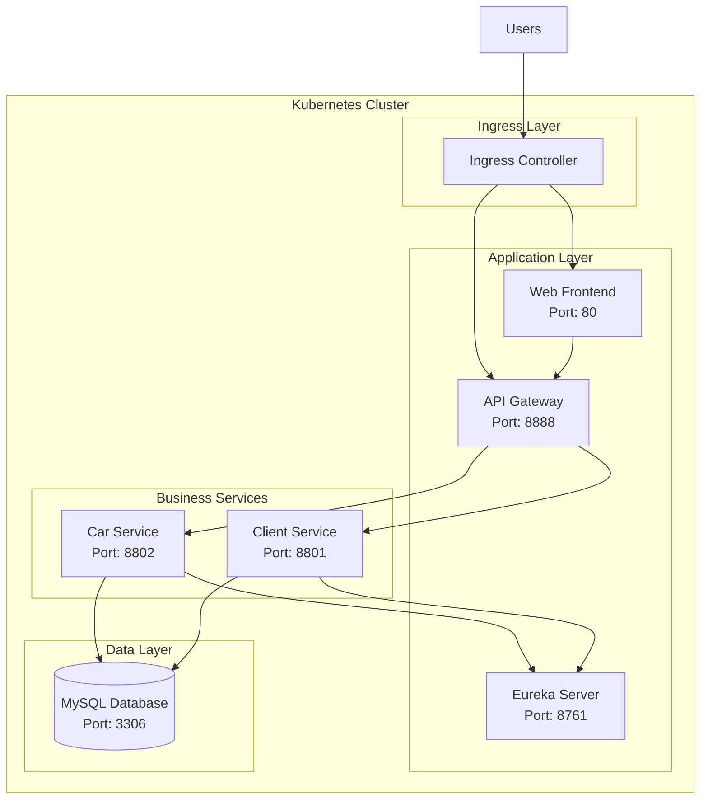

# Spring Cloud Microservices Helm Chart

[](https://helm.sh)
[](https://kubernetes.io)

A production-ready Helm chart for deploying a complete Spring Cloud microservices application on Kubernetes.

## Table of Contents

1. [Overview](#overview)
2. [Architecture](#architecture)
3. [Prerequisites](#prerequisites)
4. [Installation](#installation)
5. [Configuration](#configuration)
6. [Values Reference](#values-reference)
7. [Deployment Strategies](#deployment-strategies)
8. [Monitoring and Observability](#monitoring-and-observability)
9. [Troubleshooting](#troubleshooting)
10. [Upgrading](#upgrading)
11. [Uninstalling](#uninstalling)

## Overview

This Helm chart deploys a complete Spring Cloud microservices ecosystem including:

- **Eureka Server**: Service discovery and registration
- **API Gateway**: Single entry point with load balancing and routing
- **Car Service**: Business service for car management
- **Client Service**: Business service for client management  
- **Web Frontend**: React-based user interface
- **MySQL Database**: Persistent data storage

## Architecture



## Prerequisites

- **Kubernetes**: 1.20+ 
- **Helm**: 3.x
- **Storage Class**: For MySQL persistent volumes
- **Ingress Controller**: NGINX or similar (for external access)
- **Resources**: Minimum 4GB RAM, 2 CPU cores

## Installation

### Quick Start

1. **Add and update Helm repository** (if using external dependencies):
   ```bash
   helm dependency update
   ```

2. **Install the chart**:
   ```bash
   # Install with default values
   helm install spring-app .

   # Install with custom values
   helm install spring-app . -f values-prod.yaml

   # Install in specific namespace
   helm install spring-app . --namespace microservices --create-namespace
   ```

3. **Verify deployment**:
   ```bash
   kubectl get pods
   kubectl get services
   kubectl get ingress
   ```

### Step-by-Step Installation

1. **Clone the repository**:
   ```bash
   git clone https://github.com/marouanedbibih/devops-spring-cloud.git
   cd devops-spring-cloud/helm
   ```

2. **Review and customize values**:
   ```bash
   # Copy and modify values for your environment
   cp values.yaml values-custom.yaml
   # Edit values-custom.yaml as needed
   ```

3. **Install dependencies**:
   ```bash
   helm dependency update
   ```

4. **Deploy the application**:
   ```bash
   helm install spring-app . -f values-custom.yaml --namespace microservices --create-namespace
   ```

5. **Monitor deployment**:
   ```bash
   kubectl get pods -w -n microservices
   ```

## Configuration

### Environment-Specific Configurations

The chart supports different deployment environments through values files:

```bash
# Development Environment
helm install spring-app . -f values-dev.yaml

# Staging Environment  
helm install spring-app . -f values-staging.yaml

# Production Environment
helm install spring-app . -f values-prod.yaml
```

### Key Configuration Areas

#### 1. **Global Settings**
```yaml
global:
  environment: "production"
  resources:
    requests:
      memory: "256Mi" 
      cpu: "100m"
    limits:
      memory: "512Mi"
      cpu: "500m"
```

#### 2. **Service Images**
```yaml
eureka:
  image:
    repository: marouanedbibih/eureka
    tag: "latest"
    pullPolicy: IfNotPresent
```

#### 3. **Database Configuration**
```yaml
mysql:
  enabled: true
  auth:
    rootPassword: "secure-root-password"
    database: "app_db"
  primary:
    persistence:
      enabled: true
      size: 10Gi
```

#### 4. **Ingress Configuration**
```yaml
eureka:
  ingress:
    enabled: true
    className: nginx
    hosts:
      - host: eureka.example.com
        paths:
          - path: /
            pathType: Prefix
```

## Values Reference

### Global Values

| Parameter | Description | Default |
|-----------|-------------|---------|
| `global.environment` | Deployment environment | `production` |
| `global.resources.requests.memory` | Memory request | `256Mi` |
| `global.resources.requests.cpu` | CPU request | `100m` |
| `global.resources.limits.memory` | Memory limit | `512Mi` |
| `global.resources.limits.cpu` | CPU limit | `500m` |

### Eureka Server

| Parameter | Description | Default |
|-----------|-------------|---------|
| `eureka.replicaCount` | Number of replicas | `1` |
| `eureka.image.repository` | Image repository | `marouanedbibih/eureka` |
| `eureka.image.tag` | Image tag | `latest` |
| `eureka.containerPort` | Container port | `8761` |
| `eureka.ingress.enabled` | Enable ingress | `true` |

### API Gateway

| Parameter | Description | Default |
|-----------|-------------|---------|
| `gatewayService.replicaCount` | Number of replicas | `1` |
| `gatewayService.image.repository` | Image repository | `marouanedbibih/gateway` |
| `gatewayService.containerPort` | Container port | `8888` |
| `gatewayService.config.gatewayAllowedOrigins` | CORS origins | `*` |

### Car Service

| Parameter | Description | Default |
|-----------|-------------|---------|
| `carService.replicaCount` | Number of replicas | `1` |
| `carService.image.repository` | Image repository | `marouanedbibih/car` |
| `carService.containerPort` | Container port | `8802` |
| `carService.config.database.name` | Database name | `app_db` |

### Client Service

| Parameter | Description | Default |
|-----------|-------------|---------|
| `clientService.replicaCount` | Number of replicas | `1` |
| `clientService.image.repository` | Image repository | `marouanedbibih/client` |
| `clientService.containerPort` | Container port | `8801` |

### Web Frontend

| Parameter | Description | Default |
|-----------|-------------|---------|
| `webService.replicaCount` | Number of replicas | `1` |
| `webService.image.repository` | Image repository | `marouanedbibih/web` |
| `webService.containerPort` | Container port | `80` |

### MySQL Database

| Parameter | Description | Default |
|-----------|-------------|---------|
| `mysql.enabled` | Enable MySQL deployment | `true` |
| `mysql.auth.rootPassword` | Root password | `root123` |
| `mysql.auth.database` | Default database | `app_db` |
| `mysql.primary.persistence.enabled` | Enable persistence | `true` |
| `mysql.primary.persistence.size` | Volume size | `10Gi` |

## Deployment Strategies

### 1. **Development Environment**

```yaml
# values-dev.yaml
global:
  environment: "development"

mysql:
  primary:
    persistence:
      size: 5Gi

eureka:
  ingress:
    hosts:
      - host: eureka-dev.example.com

gatewayService:
  ingress:
    hosts:
      - host: api-dev.example.com
```

### 2. **Production Environment**

```yaml
# values-prod.yaml
global:
  environment: "production"

eureka:
  replicaCount: 2
  resources:
    requests:
      memory: "512Mi"
      cpu: "200m"

mysql:
  primary:
    persistence:
      size: 50Gi
  auth:
    rootPassword: "secure-production-password"
```

### 3. **High Availability Setup**

```yaml
# values-ha.yaml
eureka:
  replicaCount: 3

gatewayService:
  replicaCount: 3

carService:
  replicaCount: 2

clientService:
  replicaCount: 2

webService:
  replicaCount: 2
```

## Monitoring and Observability

### Health Checks

All services include Kubernetes health checks:

```yaml
livenessProbe:
  httpGet:
    path: /actuator/health
    port: 8801
  initialDelaySeconds: 60
  periodSeconds: 30

readinessProbe:
  httpGet:
    path: /actuator/health
    port: 8801
  initialDelaySeconds: 30
  periodSeconds: 10
```

### Service Monitoring

- **Eureka Dashboard**: Monitor service registration and health
- **Actuator Endpoints**: `/actuator/health`, `/actuator/metrics`
- **Kubernetes Metrics**: Resource usage and pod status

### Logging

Services are configured for structured logging with the following patterns:

```yaml
logging:
  level:
    org.springframework: INFO
    org.hibernate.SQL: DEBUG
  pattern:
    console: "%d{yyyy-MM-dd HH:mm:ss} - %msg%n"
```

## Troubleshooting

### Common Issues

#### 1. **Pods not starting**
```bash
# Check pod status
kubectl get pods

# Check pod logs
kubectl logs <pod-name>

# Describe pod for events
kubectl describe pod <pod-name>
```

#### 2. **Services not registering with Eureka**
```bash
# Check Eureka logs
kubectl logs -l app=eureka-server

# Verify network policies
kubectl get networkpolicies

# Check service discovery
kubectl port-forward svc/eureka-service 8761:8761
# Visit http://localhost:8761
```

#### 3. **Database connection issues**
```bash
# Check MySQL status
kubectl get pods -l app.kubernetes.io/name=mysql

# Check database credentials
kubectl get secrets

# Test database connection
kubectl exec -it <mysql-pod> -- mysql -u root -p
```

#### 4. **Ingress not working**
```bash
# Check ingress controller
kubectl get pods -n ingress-nginx

# Verify ingress configuration
kubectl get ingress
kubectl describe ingress <ingress-name>

# Check DNS resolution
nslookup <your-domain>
```

### Debug Commands

```bash
# Get all resources
kubectl get all

# Check events
kubectl get events --sort-by=.metadata.creationTimestamp

# Port forward for local access
kubectl port-forward svc/eureka-service 8761:8761
kubectl port-forward svc/gateway-service 8888:8888

# Scale deployments
kubectl scale deployment car-service --replicas=2

# Restart deployments
kubectl rollout restart deployment/car-service
```

## Upgrading

### Helm Upgrade

```bash
# Upgrade with new values
helm upgrade spring-app . -f values-prod.yaml

# Upgrade with new chart version
helm upgrade spring-app . --version 1.1.0

# Force upgrade
helm upgrade spring-app . --force

# Dry run to see changes
helm upgrade spring-app . --dry-run --debug
```

### Rolling Updates

```bash
# Update image tag in values.yaml, then:
helm upgrade spring-app .

# Check rollout status
kubectl rollout status deployment/car-service

# Rollback if needed
helm rollback spring-app 1
```

## Uninstalling

```bash
# Uninstall the release
helm uninstall spring-app

# Remove persistent volumes (if needed)
kubectl delete pvc -l app.kubernetes.io/instance=spring-app

# Remove namespace
kubectl delete namespace microservices
```

## Chart Development

### Template Structure

```
templates/
├── _helpers.tpl                 # Template helpers
├── eureka-*.yaml               # Eureka server resources
├── gateway-*.yaml              # API Gateway resources  
├── car-*.yaml                  # Car service resources
├── client-*.yaml               # Client service resources
├── web-*.yaml                  # Web frontend resources
├── ingress.yaml               # Global ingress
└── service.yaml               # Common service template
```

### Testing

```bash
# Lint the chart
helm lint .

# Template rendering
helm template spring-app . --debug

# Dry run installation
helm install spring-app . --dry-run --debug

# Test with different values
helm template spring-app . -f values-dev.yaml
```

### Contributing

1. Fork the repository
2. Create a feature branch
3. Make changes and test thoroughly
4. Submit a pull request

## License

This Helm chart is licensed under the MIT License - see the [LICENSE](../LICENSE) file for details.